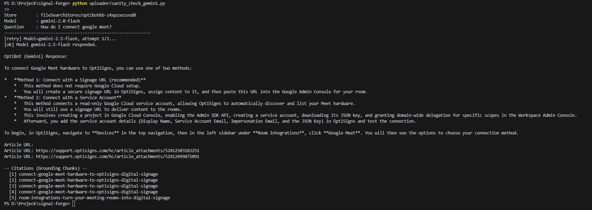

# OptiBot Clone (Take-Home Test)

This is a complete project that simulates the OptiBot AI assistant. It consists of three main components: data scraper, vector store uploader via API, and a Daily Job scheduled to run on AWS EC2.

---

## 1. Setup Instructions

Install Python 3.11+ and run the following commands:

```powershell
# Create and activate a virtual environment (recommended)
python -m venv venv
venv\Scripts\activate

# Install dependencies
pip install -r requirements.txt

# Configure the API Key (Get your key at aistudio.google.com)
$env:GEMINI_API_KEY="your-gemini-api-key-here"
```

*(Note: If using Windows PowerShell, use `$env:` as shown above. If using Command Prompt, use `set GEMINI_API_KEY=...`)*

---

## 2. Running Locally

The project is divided into independent scripts for easy testing:

### Step 1: Scraper

Run the script to scrape at least 30 articles from `support.optisigns.com` and convert them into clean Markdown.

```powershell
python scraper/run_scrape.py
```

*Result:* The `*.md` files are saved in the `data/articles/` directory.

### Step 2: Uploader

Upload the data to the Google Gemini File Search Store via API.

```powershell
python uploader/vector_store_gemini.py
```

*Result:* Creates the Store, uploads the files, and saves the state in `uploader/state_gemini.json`.

### Step 3: Sanity Check

Ask the assistant a sample question to verify the content and citations.

```powershell
python uploader/sanity_check_gemini.py
```

*Result:* Returns the answer to the question *"How do I connect google meet?"* along with the citation.

---

## 3. Chunking Strategy

This project uses the **Google Gemini API** as the core AI service. Unlike traditional RAG systems that require manual text chunking using external libraries (like LangChain), **the Gemini API automatically handles chunking server-side** when files are uploaded to the File Search Store.

**Strategy Details:**

- **Method:** Uses `white_space_config` (Gemini's default), which splits text based on whitespace and natural paragraph breaks.
- **Chunk Size (Estimated):** Approximately 800 tokens per chunk (equivalent to ~3200 characters). The code includes an estimation formula when uploading files for logging purposes.
- **Rationale:** Allowing the model (Gemini) to automatically chunk standard Markdown (`.md`) data provides the most optimal context without breaking headings or code blocks, while also minimizing the complexity of the upload script.

---

## 4. Daily Job Deployment (AWS EC2 + Docker)

The application is containerized with Docker and scheduled to run on an **AWS EC2 (Virtual Machine)** using Linux `crontab`. This mechanism ensures:

- Full re-scraping of all articles.
- Uploading only the modified data (delta) based on the SHA-256 hash algorithm saved in `manifest.json`.
- State persistence using **Docker Volumes**.

### Deployment steps on AWS EC2:

1. **Launch Virtual Machine:** Create 1 EC2 Instance (Ubuntu, t2.micro - Free Tier).
2. **Setup environment on EC2:**

   ```bash
   sudo apt update && sudo apt install docker.io git -y
   git clone https://github.com/NguyenHai2003/signal-forge.git
   cd signal-forge
   docker build -t signal-forge-job .
   ```

3. **Setup Cron Job:**
   Run `crontab -e` and add the following line to run at 03:00 AM daily:

   ```text
   0 3 * * * docker run --rm -e GEMINI_API_KEY="YOUR_API_KEY" -v /home/ubuntu/signal-forge/data:/app/data -v /home/ubuntu/signal-forge/uploader:/app/uploader signal-forge-job >> /home/ubuntu/signal-forge/cron.log 2>&1
   ```

   *Explanation: The `-v` parameter mounts 2 directories containing the state files to the EC2 hard drive, preventing them from being deleted when the container exits.*

---

## 5. Deliverables

- **Log of the last job run with 30 articles:**
  [View Log File Here](https://gist.github.com/NguyenHai2003/cd932626602d404f410fe740ad477a09)
- **Screenshot of AI answering the sample question:**
  
